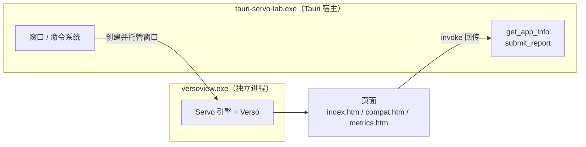

# Tauri × Servo 探索台

用 Tauri 的外壳（窗口、打包、IPC、命令系统）驱动 **Servo** 渲染引擎，在 Windows 上做早期可行性探索。
关注指标：安装包体积、启动速度、内存占用、Web 兼容性、开发期编译速度与热重载。

渲染后端通过 [`tauri-runtime-verso`](https://github.com/versotile-org/tauri-runtime-verso) 接入 ——
它把 [Verso](https://github.com/tauri-apps/verso)（基于 Servo 的浏览器）当作 Tauri 的自定义 runtime。

## 架构



**Servo 不在本程序内，而是以独立进程（`versoview.exe`）运行。**
这带来两个必须记住的后果：

1. 宿主自身编译很快，一次开发循环里不需要重编 Servo；
2. 体积与内存必须按**进程树**统计 —— 只算宿主会严重低估。

## 快速开始

前置条件：Rust 1.88+、Node 18+、MSVC 工具链、WebView2 运行时。

### 首次准备：预置 versoview（必须手工做一次）

`build.rs` 会优先使用仓库里预置的二进制，找不到时才尝试从 GitHub 下载。
为了让构建不依赖网络，请先手工预置一次：

```
curl -L -o %TEMP%\verso.tar.gz https://github.com/tauri-apps/verso/releases/download/versoview-v0.0.9/verso-x86_64-pc-windows-msvc.tar.gz
tar -xzf %TEMP%\verso.tar.gz -C src-tauri\versoview
ren src-tauri\versoview\versoview.exe versoview-x86_64-pc-windows-msvc.exe
```

`src-tauri/build.rs` 检测到该文件存在就会跳过下载。

### 开发模式：前端走 devUrl（改动免重编译）

`tauri.conf.json` 配了 `devUrl: http://localhost:1420`。**未启用 `custom-protocol` feature 时**
（即下面的 `cargo run`），webview 加载的是这个开发服务器而不是嵌入资源，
所以改完前端只需刷新页面，不必重新编译。

```
node scripts/dev-server.js                         # 终端 A：启动静态服务器（常驻）
cargo run --manifest-path src-tauri/Cargo.toml     # 终端 B：启动应用
```

`npx @tauri-apps/cli@^2 dev` 会自动执行 `build.beforeDevCommand`（同一个脚本），不必手动起服务器。

### 发布形态：前端资源编译期嵌入

```
cargo run --manifest-path src-tauri/Cargo.toml --features custom-protocol   # 不需要开发服务器
npx @tauri-apps/cli@^2 build       # 打包 NSIS 安装包（CLI 会自动带上该 feature）
```

### 其它命令

```
node scripts/build-web.js          # 由 web-src/pages.js 生成 web/*.htm
cargo run --manifest-path src-tauri/Cargo.toml -- --devtools 1234   # 开 DevTools（Firefox about:debugging 连接）
node scripts/bench.js --runs 3     # 采集指标（debug；内部固定用 custom-protocol 构建）
node scripts/bench.js --release    # 采集指标（release，含安装包体积）
```

## 实测结论

完整数据见 [`docs/metrics.md`](docs/metrics.md)（由 `scripts/bench.js` 生成）。

| 指标 | debug | release | 说明 |
| --- | --- | --- | --- |
| 宿主可执行文件 | 10.1 MB | **2.4 MB** | 开启 `opt-level="s"` + LTO + strip |
| Servo 引擎（versoview） | 101.4 MB | 101.4 MB | 独立进程，预编译二进制 |
| NSIS 安装包 | — | **27.0 MB** | 压缩后远小于两者之和 |
| 冷启动（中位） | 735–747 ms | 707–789 ms | 进程入口 → 页面脚本执行完毕 |
| 内存峰值（进程树） | 762–763 MB | 756–759 MB | 宿主 + versoview 工作集之和 |
| 前端页面重建 | 28 ms | 13–31 ms | 生成全部 `.htm` |
| 后端重编 | ~9 s | 79–111 s | 改动 `src/main.rs` 后，含 LTO 重新链接 |
| 安装包构建 | — | 3 min 16 s | release 全量编译 + NSIS |

### 怎么读这些数字

- **体积的主要矛盾在 Servo**：安装包 27 MB 里绝大部分是引擎，宿主本身只有 2.4 MB。
- **内存是最大短板**：约 760 MB 基本是 Servo 的固有开销（页面极其简单也是如此），
  与页面复杂度关系不大。这是选型时最需要权衡的一项。
  本次未做 WebView2 基线对照（按选择只做 Tauri + Servo），因此不给出与 WebView2 的对比结论。
- **冷启动约 0.7 s**：包含启动一个完整的浏览器引擎进程，属于合理范围。
- **release 的 111 s 重编**是 LTO 全量链接的代价；日常开发应留在 debug（约 9 s）。

## Web 兼容性

用同一份探测代码在 Servo 下运行，逐项结果见 [`docs/compat-matrix.md`](docs/compat-matrix.md)。
**112 项支持度探测中通过 64 项（57.1%）。**

对界面开发影响最大的几类缺口：

- **CSS Grid 不支持**。这条要特别强调：`CSS.supports('display', 'grid')` 与
  「真实挂上 `display:grid` 再读计算值」两种方法都判定不支持（计算值是 `block`），
  已排除探测方法误判。**布局方案必须基于 flexbox**（flexbox 正常）。
- **图形：WebGL 1/2、WebGPU、OffscreenCanvas 均不支持**；Canvas 2D、Path2D、ImageBitmap 正常。
  图表、地图、3D、视频处理类界面需要提前评估或准备降级方案。
- **观察者 API 缺失**：`ResizeObserver`、`IntersectionObserver` 不支持，
  会影响不少 UI 框架以及懒加载、自适应布局方案。
- **存储与并发受限**：`IndexedDB`、`Cache Storage`、`Service Worker`、`SharedArrayBuffer`、
  `Atomics` 均不支持，离线与多线程方案需要重新设计；`localStorage` / `sessionStorage` 可用。
- **`AbortController` 不支持**，但 `fetch` 可用 —— 需要中断请求时要另想办法。

表现正常的部分包括：`fetch`、`XMLHttpRequest`、`WebSocket`、`Web Worker`、`WebAssembly`、
Canvas 2D、`requestAnimationFrame`、Shadow DOM、Custom Elements、`Intl`、`Blob`/`File`、
`localStorage`、指针事件、异步剪贴板（页面内）等。

> 探测页支持三种状态（通过 / 部分支持 / 不支持），可按名称过滤并导出 JSON；
> 也可用 `node scripts/bench.js --compat-only` 无人值守地刷新矩阵。

## 已知限制

- **前端改动**：开发模式（`cargo run`，未启用 `custom-protocol`）下页面来自 `devUrl`，
  改完刷新即可；代价是 1420 端口上的开发服务器必须在场，否则页面白屏。
  `tauri build` 的发布形态仍是编译期嵌入资源。尚未做框架级 HMR（自动刷新），当前要手动刷新。
- **WebGL / WebGPU 缺失**（见上）。
- **安全**：`tauri-runtime-verso` 硬编码了自定义协议 IPC 的 `Origin`，因此不要用它加载任意外部网站。
- **移动端不支持**：该 runtime 目前只覆盖 Linux / Windows / macOS。
- **运行机理**：Servo 以独立进程运行，宿主与引擎之间是 IPC 通信，
  这与 WebView2 的进程内托管模型不同，调试链路也因此更长（可通过 `--devtools` 接 Firefox）。

## 目录结构

```
web-src/pages.js       页面源码（.htm 的唯一真实来源）
web/                   前端资源；*.htm 为构建产物，*.css/*.js 手写维护
scripts/build-web.js   生成 .htm
scripts/dev-server.js  开发期静态服务器（配合 devUrl）
scripts/make-icon.js   生成 .ico（不依赖外部图片与图像库）
scripts/bench.js       指标采集与报告生成
src-tauri/build.rs     versoview 预置检测 + 生成 Tauri 上下文
src-tauri/src/main.rs  宿主：Verso runtime 接线、命令、报告模式
docs/                  指标与兼容性报告
```
